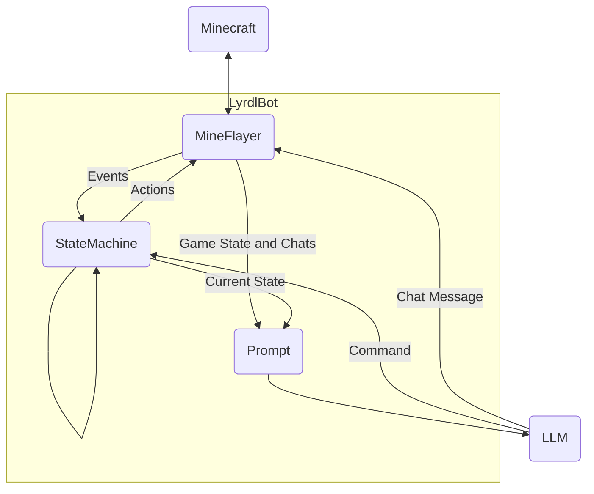
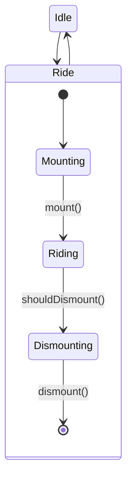

# LyrdlBot
## Usage
OPEN_AI_KEY=<OPEN_AI_KEY> node lyrdlbot.js <SERVER_IP> <SERVER_PORT> <EMAIL_ADDRESS> <PASSWORD>
## How it works

LyrdlBot uses Mineflayer.js to communicate with the Minecraft server, it triggers in game actions and listens for what is happening in the game world.

It notifies the StateMachine of any events in case that triggers a state transition e.g. the player has boarded a boat.

It is the current state of the StateMachine that determines what the robot does in the Minecraft game e.g. attempting to board a boat.

The StateMachine's current state, recent chat messages and various pieces of game data (health, location etc) are added to the core prompt (prompt.txt) sent to the LLM.

The LLM, which is the gpt-3.5-turbo model from OpenAi will then return a JSON object containing command and a chat message. 

The message is posted to Minecraft chat and the command is sent to the StateMachine.

StateMachine example:

Each state represents the current task of the robot, for example in the Ride state the robot mounts, rides and dismounts a vehicle. Ride has substates Mounting, Riding and Dismounting, these represents the steps in the Ride task. `mount()`, `dismount()` are events passed by Mineflayer. `shouldDismount()` is a command passed by the LLM model. The Mounting and Dismounting states interact with the game world to attempt to mount or dismount a boat.## Lyrdl Bot commands:
- **lb follow** -> make me follow you (WIP - cannot go through doors)
- **lb stop** -> make me return to idle state
- **lb get in** -> make me get in the nearest boat
- **lb get out** -> make me get out of a boat
- **lb step [forward|back|left|right]** -> make me take a step in the given direction
- **lb goto [x] [y] [z]** -> make me head to the given coords
- **lb goto [waypoint]** -> make me head to the given waypoint
- **lb waypoint [name] [x] [y] [z] [overworld|the_nether|the_end]** -> save a waypoint with the given name coords and dimension (see waypoints in "memory.json")
- **lb sleep** -> make me sleep in the nearest bed
- **lb wake** -> make me wake up
- **lb take** -> make me take all items from the nearest chest
- **lb dump** -> make me dump all items in the nearest chest
- **lb gunpowder** -> send me on a mission to collect gunpowder
- **lb @** -> ask for my location
- **lb status** -> ask me how I'm feeling (WIP)
## On the roadmap:
- Handle doors
- Alphabetical item sorting
- Activate mob switch
- LLM interface
- Report status including food supply
- x z goto and waypoint coords
