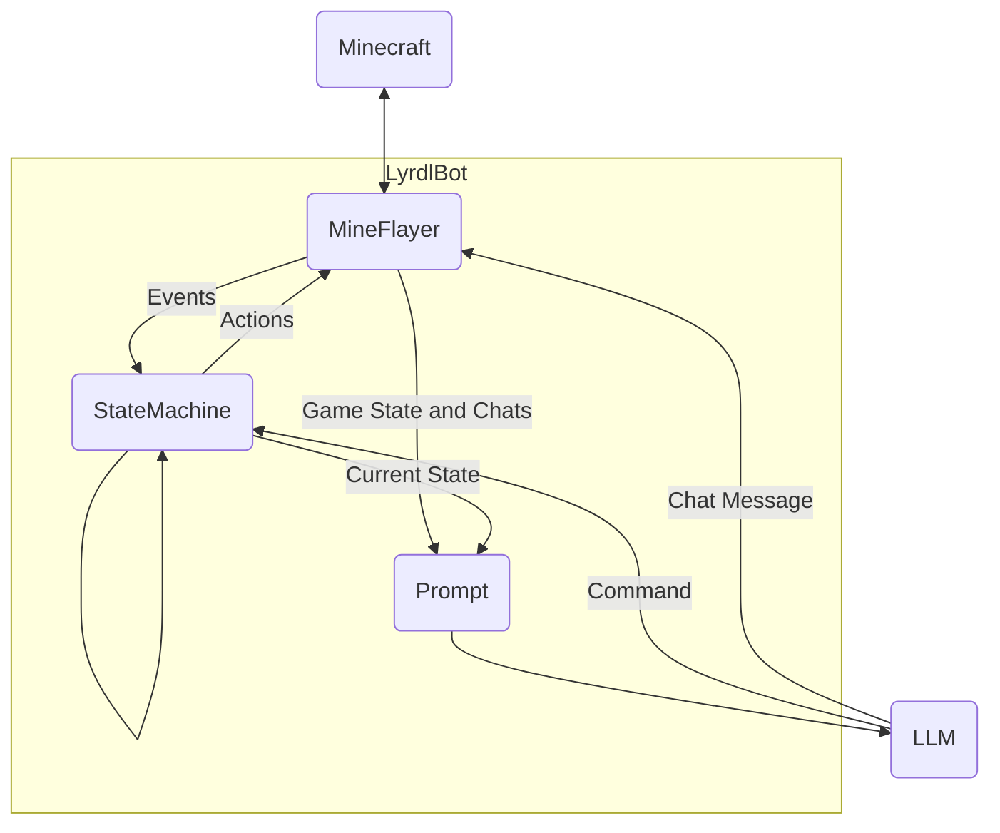
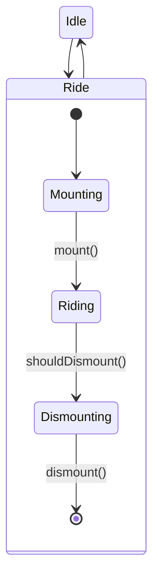

# LyrdlBot
## Usage
OPEN_AI_KEY=<OPEN_AI_KEY> node lyrdlbot.js <SERVER_IP> <SERVER_PORT> <EMAIL_ADDRESS> <PASSWORD>
## How it works

LyrdlBot uses Mineflayer.js to communicate with the Minecraft server, it triggers in game actions and listens for what is happening in the game world.

It notifies the StateMachine of any events in case that triggers a state transition e.g. the player has boarded a boat.

It is the current state of the StateMachine that determines what the robot does in the Minecraft game e.g. attempting to board a boat.

The StateMachine's current state, recent chat messages and various pieces of game data (health, location etc) are added to the core prompt (prompt.txt) sent to the LLM.

The LLM, which is the gpt-3.5-turbo model from OpenAi will then return a JSON object containing command and a chat message. 

The message is posted to Minecraft chat and the command is sent to the StateMachine.

See `prompt.txt` for the full setup prompt.

StateMachine example:

Each state represents the current task of the robot, for example in the Ride state the robot mounts, rides and dismounts a vehicle. Ride has substates Mounting, Riding and Dismounting, these represents the steps in the Ride task. `mount()`, `dismount()` are events passed by Mineflayer. `shouldDismount()` is a command passed by the LLM model. The Mounting and Dismounting states interact with the game world to attempt to mount or dismount a boat.
## Lyrdl Bot commands:
Lyrdl Bot now runs an LLM so commands can be made in natural language. However, there are a finite number of commands that Lyrdl Bot itself is able to use to interact with Minecraft:
- FOLLOW: make the robot follow the player named "username"
- STOP: make the robot return to idle state
- GET_IN: make the robot get in the nearest boat
- GET_OUT: make the robot get out of a boat
- STEP: make the robot take a step in the given direction (one of ["forward","back","left","right"])
- GOTO: make the robot head to the given x y and z coordinates
This command can optionally have a "waypoint" property in extras instead of coordinates
- WAYPOINT: save a waypoint with the given name, coordinates, dimension (one of ["overworld","the_nether","the_end"]) and optional description.
- SLEEP: make the robot sleep in the nearest bed
- WAKE: make the robot sleep in the nearest bed
- TAKE: make the robot take all items from the nearest chest
- DUMP: make the robot deposit all items from the nearest chest
- GUNPOWDER: send the robot on a multi step mission to collect gunpowder
This command has an optional extra "state" which will continue the mission from a particular step
## On the roadmap:
- Handle doors
- Alphabetical item sorting
- Activate mob switch
- Set up camp command
